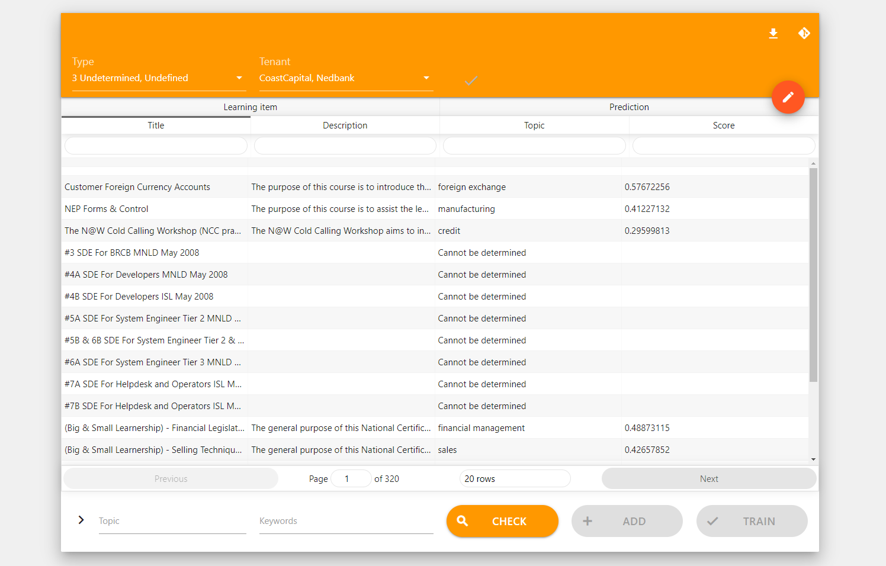

# Annotation Tool


A simple tool to edit keywords json

## Getting Started

Connet to **SAP-Corporate** network first

Then visit [http://lssinh031.sin.sap.corp:2233](http://lssinh031.sin.sap.corp:2233)

### Main Application



### Annotation Process

1. Click on top selection to choose type and tenants

2. On bottom type in new topic (will autocomplete if topic exist) and keywords

3. Click check button, the learning items that matches keywords will be filtered

4. Confirm addition by add button and new json can view from top right edit

### Manual edit JSON file

Manual edit JSON by top right corner button make the review and revert of changes possible


## For developer 

### Docker

### docker screen

screen session `lr_topics_tool`
```
screen -r lr_topics_tool 
```
resume screen

ctrl+A+D to exit

Source location at `/home/lr_topics/lr_topics_tool`

Docker image & process name `lr_tool`

Go inside the container
```
docker exec -it lr_tool /bin/bash
```
Working directory `/usr/src/lr_topics_tool`

For updating copy the source location file to working directory

### Prerequisites
```
nodejs npm
```
### Installing
```
npm i
```
Unfortunately, react hot reloader has not fully implemented, need to manually build
```
npm run build
```
### Start server
```
npm run server
```

## Built With
* [NodeJS](https://reactjs.org/) - The web framework
* [React](https://reactjs.org/) - The user interfaces
* [Express](https://expressjs.com/) - The backend server

## Authors
* **Han Jiyao** - *Initial work*

## License
This project is licensed under the MIT License - see the [LICENSE.md](LICENSE.md) file for details
