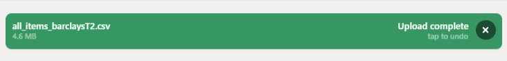
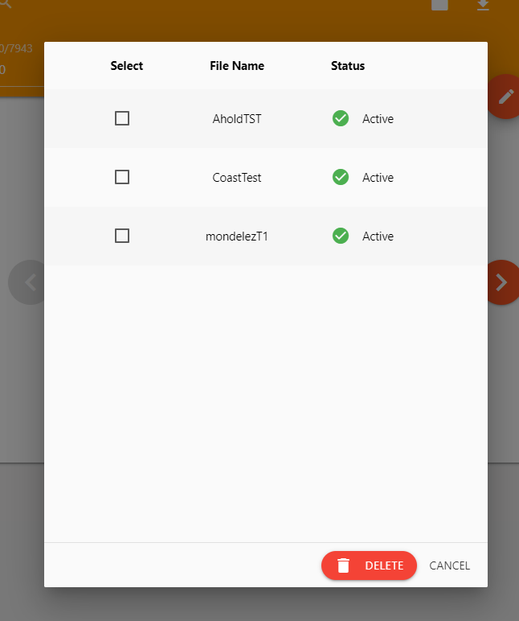

# Annotation Tool


A simple tool to edit json, manual label base on title and description

### Features

- CVS & JSON parsing
- Dynamic file l/O
- Search & instant result filtering
- Inbuild JSON editor
- Hotkeys & Gestures support
- Mobile friendly

## Getting Started

Connet to **SAP-Corporate** network first

Then visit [http://lssinh031.sin.sap.corp:2233](http://lssinh031.sin.sap.corp:2233)

### Main Application


### File Management 

Import files (can be `xxx.csv` or actual data `all_items_Mearged.json` / `topics_keywords_latest.json`) at bottom

Note the .csv format need at least these three columns

Title | Description | Topic
--- | --- | ---
Finibus Bonor | Lorem ipsum dolor sit amet, consectetur adipiscing elit | Design

Upload in progress



After upload the page should refresh, if not please manually refresh data by the refresh btn next to it (this may take a while)

You can manage your files by setting active editing files 


Delete files here



### Navigation

By arrow buttons / hotkeys / swipe on content

#### Hotkeys

- **A / ←**: previous item
- **D / →**: next item
- **Y**: select yes label
- **N**: select no label
- **Enter**: focus on topic selection
- **C**: start checking
- **F**: focus on searching

### Annotation Process

1. Click on Title to select keywords


2. Choose appropriate topic


3. Click check button

4. Confirm the new keywords by browsing through the existing data (other data that may affect by this keyword)


5. Add new keywords and the existing data will be filter out

### Manual edit JSON file

Manual edit JSON by top right corner button make the review and revert of changes possible


(Note: This save process will re-filter all items again which will take some time)

## For developer 

### Docker

Source location at `/data/lr_topics/label-tool`

Docker image & process name `lr_topics_tool`

Go inside the container
```
docker exec -it lr_topics_tool /bin/bash
```
### Prerequisites
```
nodejs npm
```
### Installing
```
npm i
```
Unfortunately, react hot reloader has not fully implemented, need to manually build
```
npm run build
```
### Deployment
set port (except 2233)
```
export PORT=3000
```
Start server
```
npm run server
```
The data stored at `/urs/src/lr_topics_tool/data`

## Built With
* [NodeJS](https://reactjs.org/) - The web framework
* [React](https://reactjs.org/) - The user interfaces
* [Express](https://expressjs.com/) - The backend server

## Authors
* **Han Jiyao** - *Initial work*

## License
This project is licensed under the MIT License - see the [LICENSE.md](LICENSE.md) file for details
